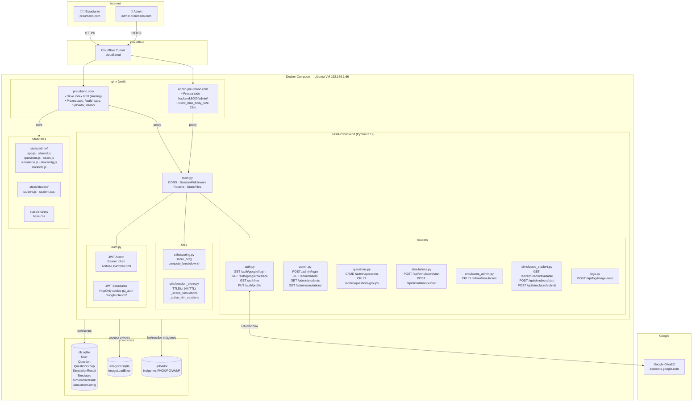

```mermaid
graph TB
    subgraph Internet
        Estudiante["👨‍🎓 Estudiante\npreurbano.com"]
        Admin["🔧 Admin\nadmin.preurbano.com"]
    end

    subgraph Cloudflare
        CF["Cloudflare Tunnel\ncloudflared"]
    end

    subgraph Docker["Docker Compose — Ubuntu VM 192.168.1.66"]
        subgraph Web["nginx (web)"]
            NginxMain["preurbano.com\n• Sirve index.html (landing)\n• Proxea /api/, /auth/, /app, /uploads/, /static/"]
            NginxAdmin["admin.preurbano.com\n• Proxea todo → backend:8000/admin/\n• client_max_body_size 25m"]
        end

        subgraph Backend["FastAPI backend (Python 3.12)"]
            Main["main.py\nCORS · SessionMiddleware\nRouters · StaticFiles"]

            subgraph Routers
                R2["auth.py\nGET /auth/google/login\nGET /auth/google/callback\nGET /auth/me\nPUT /auth/profile"]
                R3["admin.py\nPOST /admin/login\nGET /admin/users\nGET /admin/students\nGET /admin/simulations"]
                R4["questions.py\nCRUD /admin/questions\nCRUD /admin/questions/groups"]
                R5["simulations.py\nPOST /api/simulation/start\nPOST /api/simulation/submit"]
                R6["simulacros_admin.py\nCRUD /admin/simulacros"]
                R7["simulacros_student.py\nGET /api/simulacro/available\nPOST /api/simulacro/start\nPOST /api/simulacro/submit"]
                R8["logs.py\nPOST /api/log/image-error"]
            end

            subgraph Utils
                U1["utils/scoring.py\nscore_pct()\ncompute_breakdown()"]
                U2["utils/session_store.py\nTTLDict (4h TTL)\n_active_simulations\n_active_sim_sessions"]
            end

            subgraph Auth["auth.py"]
                A1["JWT Admin\nBearer token\nADMIN_PASSWORD"]
                A2["JWT Estudiante\nHttpOnly cookie pu_auth\nGoogle OAuth2"]
            end
        end

        subgraph Storage["Volúmenes"]
            DB[("db.sqlite\nUser\nQuestion\nQuestionGroup\nSimulationResult\nSimulacro\nSimulacroResult\nSimulationConfig")]
            ADB[("analytics.sqlite\nImageLoadError")]
            UPL[("uploads/\nimágenes PNG/JPG/WebP")]
        end

        subgraph Static["Static files"]
            S1["static/admin/\napp.js · shared.js\nquestions.js · users.js\nsimulacos.js · simconfig.js\nstudents.js"]
            S2["static/student/\nstudent.js · student.css"]
            S3["static/shared/\nbase.css"]
        end
    end

    subgraph Google
        GOAUTH["Google OAuth2\naccounts.google.com"]
    end

    Estudiante -->|HTTPS| CF
    Admin -->|HTTPS| CF
    CF --> NginxMain
    CF --> NginxAdmin
    NginxMain -->|proxy| Main
    NginxAdmin -->|proxy| Main
    Main --- Routers
    Main --- Utils
    Main --- Auth
    R2 <-->|OAuth2 flow| GOAUTH
    Backend -->|lee/escribe| DB
    Backend -->|escribe errores| ADB
    Backend -->|lee/escribe imágenes| UPL
    NginxMain -->|sirve| Static
```
